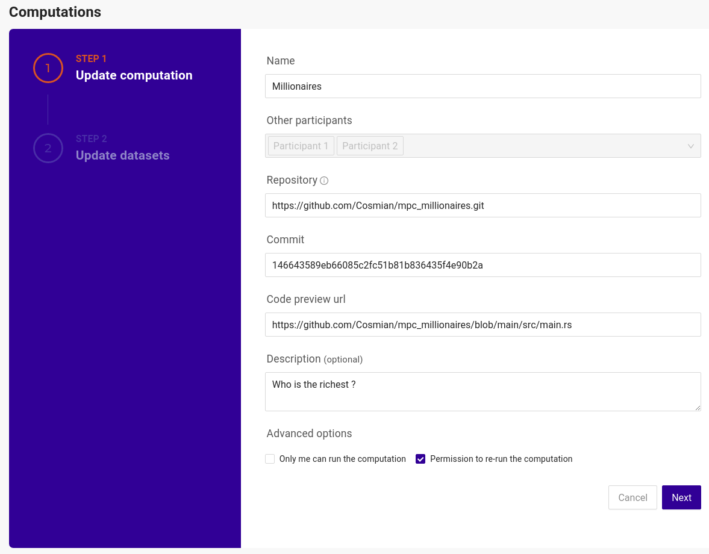

# CipherCompute

CipherCompute is the [Cosmian](https://cosmian.com) enterprise software that enables **collaborative confidential computations** between a set of participants. It provides the cryptographic engine, computation setup and approval user interfaces, integration into enterprise IT, logging and auditing.


 - [The millionaires](#the-millionaires)
 - [Secure Multi-Party Computation (sMPC)](#secure-multi-party-computation-smpc)
 - [Free access to EAPs for developers and experimentation](#free-access-to-eaps-for-developers-and-experimentation)
 - [Install & Start](#install-&-start)
 - [Quickstart Guide](#quickstart-guide)
 - [Congratulations and next steps](#congratulations-and-next-steps)


## The millionaires

Alice, Bob and Charlie are millionaires and want to rank their wealth without revealing their actual wealth to each other.
CipherCompute provides them with all the enterprise tools to 

 - write an algorithm in a high level language ([rust](https://www.rust-lang.org/)) to solve this problem: [right here !](https://github.com/Cosmian/mpc_millionaires)
 - deploy the algorithm and orchestrate the participants approval process to perform the computation using a nice modern UI
 - run the algorithm as a confidential computation
 - selectively disclose the results to the participants (the algorithm reveals her rank to Alice but does not reveal it to Bob and Charlie)

 The [Quickstart Guide](#quickstart-guide) shows you how to do this and more, quickly and for free using the [EAP version](#free-access-to-eaps-for-developers-and-experimentation) of CipherCompute

Given the genericity and expressiveness of `rust` to write algorithms, CipherCompute is used to solve many different collaborative confidential computation problems across many industries (banking, health, industrial, defense etc...):

 - Key Performance Indicators comparaisons beween entities that do not want to share their financial and operational data (the business version of the millionaires)
 - Datasets Generation and Anonymization from confidential sources for Data Science and Federated Learning (see [mpc_join](https://github.com/Cosmian/mpc_join))
 - Collision and Interception detection from confidential trajectory sources
 - Pathology Scoring Algorithms from confidential hospital records and medcal sensors readings
 - Augmented Collaborative Cyberscurity threat detection using secret comparaisons and aggregations of IOCs
 - etc...

## Secure Multi-Party Computation (sMPC)

The EAP version of CipherCompute in this repository mostly relies on an advanced cryptographic primitive known as **Secure Multi-Party Computation** and software developed in a joint effort with the University of KU Leuven around the [SCALE](https://github.com/KULeuven-COSIC/SCALE-MAMBA) engine. 

In a nutshell MPC offers the ability to perform a confidential collaborative computation without moving or sharing data and by distributing an algorithm on participants servers. The servers will interact during the computation phase and exchange encrypted intermediate results. It is formally proven that these exchanges do not reveal anything of the actual data behind the servers.

That participants data does not move, is one of the most attractive aspect of sMPC: improved RGPD compliance, reduced CyberSecurity risk, etc...

For additional details on Cosmian, our relationship with the (cryptography) academia and the technologies we use, please check our [website](https://cosmian.com).


## Free access to EAPs for developers and experimentation

Instructions below will install in a single step a developer version which is a set of 3 CipherCompute instances, each representing a participant to a confidential computation. You will be running on your computer your first confidential computation (the Millionaires) in minutes and start hacking MPC algorithms, for free.

The CipherCompute versions installed are full featured and are the EAP (Early Access Program) versions. EAPs may contain features not yet available in the production versions but which are still unstable. EAPs auto-expire after 90 days and are not meant for running computations in production, but are sufficient however to develop and test MPC production grade algorithms.

Your invaluable feedback is welcome: de not hesitate to open issues against this repository.

## Install & Start

Please install [docker-compose](https://docs.docker.com/compose/install/) and clone this repository.

Installing and running the developer version of Cosmian CipherCompute is done in a single step with Docker Compose from the repository root directory

```console
sudo docker-compose up
```

Docker will pull the required containers and start them. Once running, the 3 participants web user interfaces are available at:

 - Participant 0 (a.k.a Player 0): http://localhost:3000
 - Participant 1 (a.k.a Player 1): http://localhost:3001
 - Participant 2 (a.k.a Player 2): http://localhost:3002
 
 An admin user is pre-created on each instance:

  - username: `hello@world.com`
  - password: `azerty`

A successful login will get you to the dashboard 

## Quickstart Guide

The first computation we are going to set-up is that of the "Millionaires": 

Alice, Bob and Charlie are all millionaires and they would like to know their total wealth and how they compare to each other over 3 years, without disclosing their actual wealth to each other.

This guide is going to help you set the computation up between the participants and run it. 

The sMPC algorithm [has already been developed](https://github.com/Cosmian/mpc_millionaires) in `rust` and is heavily commented to help you start hacking your own MPC algorithms. 


### Handshake Alice, Bob and Charlie

A relationship must first be established between the participants: Participant 0, Alice, is going to invite the 2 other participants, Bob and Charlie, to participate in the computation.

 - login to Alice at http://localhost:3000
 - click on `Participants` in the main menu 
 - then `Add new participant`
 - enter the URL for Bob: `http://orchestrator_1:9001` and a description

 - redo the same operation to add Charlie with URL: `http://orchestrator_2:9002`
  

Now login to Bob at http://localhost:3001 to accept the invitation

 - click on `Participants` in the main menu 
 - accept participant 0 (Alice) by clicking on the accept button
 
 
 
 - Redo the same operation to add Charlie as participant 2 with URL: `http://orchestrator_2:9002`


Once complete, all participants should show as approved on Alice screen

 


### Create the computation

Alice will act as the computation leader: she will create the computation and propose it to the other participants for approval.

 - login to Alice at http://localhost:3000 
 - click `Computations` in the main menu
 - click `Create new computation`

Fill in the computation details:
 - Name: `Millionaires` (or whatever name you fancy)
 - Participants: select `Participant_1` and `Participant_2`
 - Repository: this is where the algorithm code is available: https://github.com/Cosmian/mpc_millionaires 
 - Commit: the exact version of the code: `146643589eb66085c2fc51b81b836435f4e90b2a`
 - Code preview url: an URL other participants can click to have a quick look at the code: https://github.com/Cosmian/mpc_millionaires/blob/main/src/main.rs
 - Description: something meaningful for Bob and Charlie: `Who is the richest ?`
 



In the next screen, we will specify the meta-data of the data expected to be provided by Alice, Bob and Charlie. Start with us (Alice)

- Choose the dataset owner: choose `local` (us/Alice)
- Select source: we will need to link a new data set, so select: `Request a missing dataset`
- Dataset description: a description useful for the user which will actually perform the connection to an existing data source `A 2 column dataset (year, wealth) sorted by year ascending`
- Required columns: specify the 2 required columns:
    - `year`: `vear`
    - `wealth`: `amount`
- Provide simulation data: this is sample data that can be provided to the approvers for them to easily simulate the computation before approving it. You can leave blank or use: https://raw.githubusercontent.com/Cosmian/mpc_millionaires/main/data/inputs/player_0.json


Then request Bob's data: 

 - Click `Add new Dataset`, 
 - select `Participant_1` and provide similar details.
 - for the simulation data , leave blank or use: https://raw.githubusercontent.com/Cosmian/mpc_millionaires/main/data/inputs/player_1.json


Finally, request Charlie's data: 

 - Click `Add new Dataset`, 
 - select `Participant_2` and provide similar details.
 - for the simulation data , leave blank or use: https://raw.githubusercontent.com/Cosmian/mpc_millionaires/main/data/inputs/player_2.json

Then click `Create Computation` 


Review the Computation and click `Submit Draft`


### Provide access to the dataset and approve the computation

Now that the computation has been specified, Alice, Bob and Charlie need to link their actual dataset to the computation and approve it.

On Alice, from the `Computations` menu, access the computation by clicking `Review` and click `Provide dataset` at the bottom of the screen


then fill in the required details:

 - Name: `Alice Wealth`
 - Description: `A 2 column dataset (year, wealth) sorted by year ascending`
 - Source type: select `CSV` which is the only source type supported by the developer version
 - Source URL `alice.csv`. The csv file is already available in the `./data/participant_0` folder which is the data root folder for Alice
 - CSV Column Names: enter `year` and ` wealth`
 - Columns separator: `,`
 - Headers on first line: `No`
 - Decimal separator: `.`
 - Columns: map:
    - `year` > `year` 
    - `wealth` > ` wealth`

  Click `Submit datasource`


Review all the data entered and click `Approve`


The computation is now submitted for approval to all other participants.


Now login to both Bob (http://localhost:3001) and Charlie (http://localhost:3002) and perform the same steps to link their datasets. All data to enter is identical except for the files:

 - Bob: `bob.csv`
 - Charlie: `charlie.csv`

 Once completed, go back to Alice and  from the `Computations` menu, access the computation by clicking `Review`. All participants have now approved the computation and it is ready to run

 


### Run the Computation

The rust code is going to be pulled on all the machines, compiled and interactively executed.
When the computation completes (about 30 seconds on 1st run, less on subsequent runs), Alice screen will display the results

 - column 1: the year
 - column 2: Alice wealth
 - column 3: the sum of the 3 wealths
 - column 4: Alice rank


Check Bob and Charlie results on their own instance.

## Congratulations and next steps

You have now run your first MPC computation !

Please have look at other readily available computations in the [Github Cosmian repository](https://github.com/Cosmian) - those starting with `mpc_`, the [mpc_join](https://github.com/Cosmian/mpc_join) in particular which is the base of many confidential data sciences projects.

These projects provide documentation to help you get started hacking your own MPC code.


## Known caveats with the EAP developer version

These are EAPs, not production versions:
- UIs are accessed on plain HTTP
- communication between components __other than the communication linked to the MPC protocol which is encrypted and formally proven secure__ is NOT encrypted.

Others:
- cookies are shared among browser: using the same browser for the 3 participants UIs will have you re-login each time you jump from one participant to another because they all run on `localhost`. In production, the 3 UIs are used by different participants on different domains. To work around this, annoyance, we suggest to use different browsers for every participant (i.e.: firefox, firefox incognito mode, brave, chromium,...)
