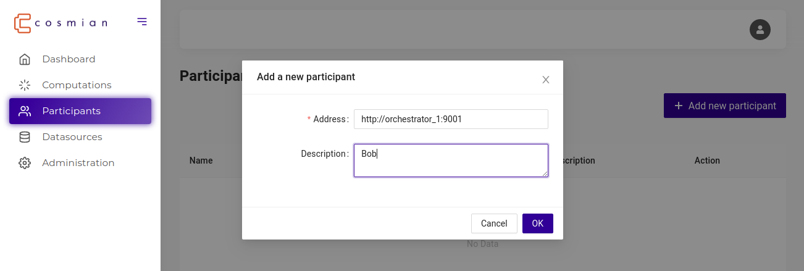
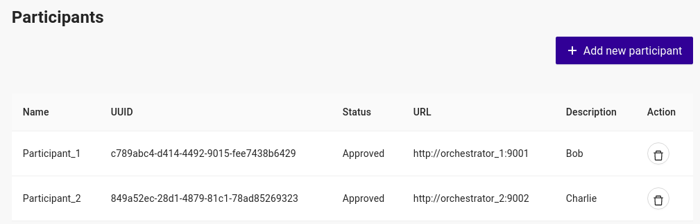
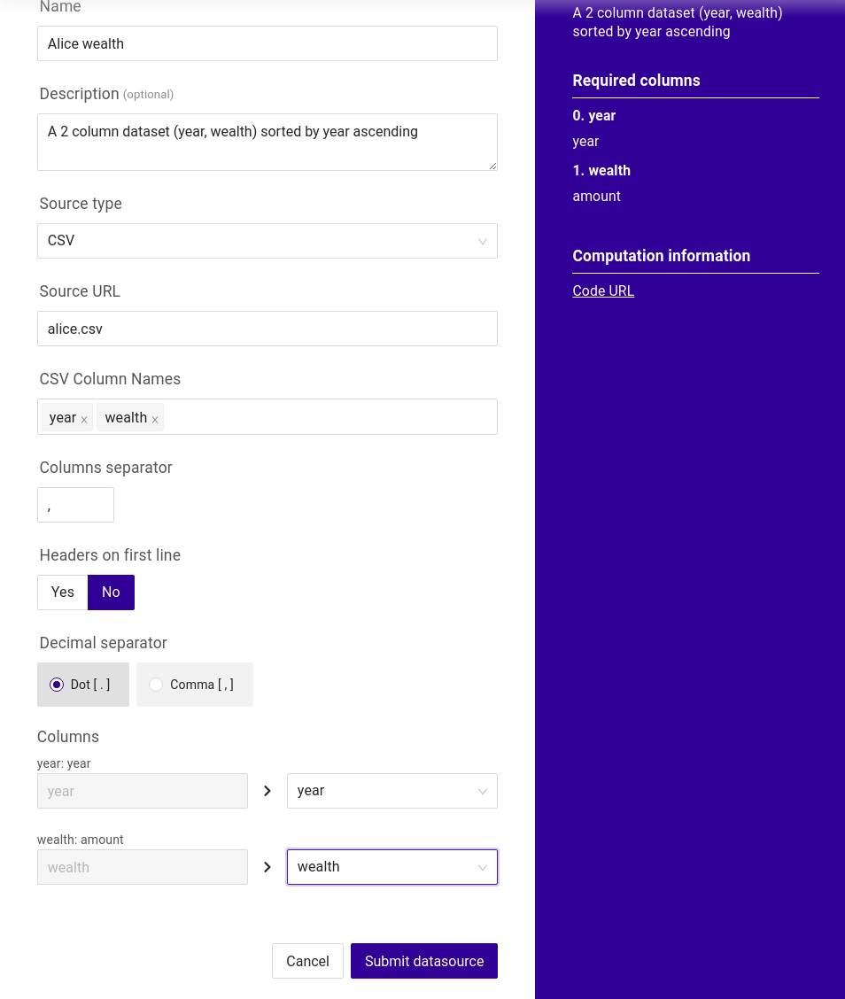
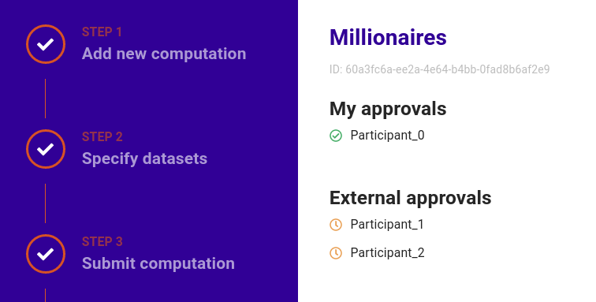

# CipherCompute

CipherCompute is the [Cosmian](https://cosmian.com) product that enables **collaborative confidential computations** between a set of participants.

Say Alice, Bob and Charlie want to rank their wealth without revealing their net worth to each other.
CipherCompute provide them with all the tools to 

 - write an algorithm in a high level language (Rust) to precisely solve this problem
 - deploy the algorithm and orchestrate the participants approval to the computation process using a nice modern UI
 - run the algorithm as a confidential computation
 - selectively or collectively disclose the result to the participants (the algorithm may reveal her rank to Alice but not that of Bob or Charlie)

Given the genericity and expressiveness of Rust to write algorithms, CipherCompute is used to solve many different collaborative confidential computation problems across many industries.

The version of CipherCompute in this repository mainly relies on an advanced cryptographic primitive known as **Secure Multi-Party Computation** and related work on the [SCALE](https://github.com/KULeuven-COSIC/SCALE-MAMBA) engine of KU Leuven. For additional details on Cosmian, our relationship with the (cryptography) academia and the technologies we use, please check our [website](https://cosmian.com).


## Free access to EAPs for developers and experimentation

Instructions below will install in a single step a developer version which is a set of 3 CipherCompute instances, each representing a participant to a confidential computation. You will be running on your computer your first confidential computation in minutes and start hacking algorithms, for free.

The CipherCompute versions installed are full featured and are the EAP (Early Access Program) versions. EAPs may contain features not yet available in the production versions but which are still unstable. They auto-expire after 90 days. EAPs are not meant for running computations in production but are sufficient however to develop and test MPC production grade algorithms.

Your invaluable feedback is welcome: de not hesitate to open issues against this repository.

## Install & Start

Please install [docker-compose](https://docs.docker.com/compose/install/) and clone this repository.

Installing and running the developer version of Cosmian CipherCompute is done in a single step with Docker Compose from the repository root directory

```console
sudo docker-compose up
```

Docker will pull the required containers and start them. Once running, the 3 participants web user interfaces are available at:

 - Participant 0 (a.k.a Player 0): http://localhost:3000
 - Participant 1 (a.k.a Player 1): http://localhost:3001
 - Participant 2 (a.k.a Player 2): http://localhost:3002
 
 An admin user is pre-created on each instance:

  - username: `hello@world.com`
  - password: `azerty`

A successful login will get you to the dashboard 

## Quickstart

Consider a computation where 2 participants want to find common Customer IDs between their private lists but they do not want to disclose their full list to each other; technically, they want to perform an inner join of their datasets. The sample datasets used in this simple example are.
- [dataset participant 0](data/participant_0/data.csv)
- [dataset participant 1](data/participant_1/data.csv)

The provided MPC (Multi-Party Computation) program has been developed in Rust to compute a merge join and will be used in this example.

The MPC system requires 3 participants at minimum, so in this example one participant (participant 2) will not provide any data, nor receive any result and only plays the role of an arbiter.

### Handshake the participants

A relationship must first be established between the participants: Participant 0 si going to invite the 2 other participants to participate in a computation.

 - login to participant 0 at http://localhost:3000
 - click on `Participants` in the main menu 
 - then `Add new participant`
 - enter the URL for participant 1: `http://orchestrator_1:9001` and a description

 - redo the same operation to add participant 2 with URL: `http://orchestrator_2:9002`


Now login to participant 1 at http://localhost:3001 to accept the invitation

 - click on `Participants` in the main menu 
 - accept participant 0 by clicking on the accept button
 
 - Redo the same operation to add participant 2 with URL: `http://orchestrator_2:9002`


Once complete, all participants should show as approved on participant participant_0
 


### Create the computation

Participant 0 is going to act as the leader: it will create the computation and propose it to the other participants for approval.

 - login to participant 0 at http://localhost:3000 
 - click `Computations` in the main menu
 - click `Create new computation`

Fill in the computation details:
 - Name: `Common Customers` (or whatever name you fancy)
 - Participants: select `Participant_1` and `Participant_2`
 - Repository: this where the algorithm code lives: https://github.com/Cosmian/mpc_join_2_participants.git 
 - Commit: the exact version of the code: `8578a8022e04360f1e36278da8de4160dd42154f`
 - Code preview url: an URL other participants can click to have a quick look at the code: https://github.com/Cosmian/mpc_join_2_participants/blob/main/src/main.rs
 - Description: something meaningful for the other players: `This computation will reveal to participant 0 and participant 1 their common customers`


In the next screen, specify the data expected to be provided by participant 0 (us a.k.a. local) and participant 1

- Choose the dataset owner: choose `local` (us)
- Select source: we will need to link a new data set, so select: `Request a missing dataset`
- Dataset description: a description useful for the user which will actually perform the connection to an existing data source `A 2 column dataset (customer id, sales amount) sorted by customer id`
- Required columns: specify the 2 required columns:
    - `id`: `customer`
    - `sales`: `sales amount`
- Provide simulation data: this is dummy data that can be provided to the approvers for them to easily simulate the computation before approving it. Leave blank for now

Click `Add new Dataset`, select `Participant_1` and provide similar details


Click `Next`, review the Computation and click `Submit Draft`

### Provide access to the dataset and approve the computation

Now that the computation has been specified, participant 0 needs to link its dataset to an actual data source and approve the computation.

On participant 0 from the `Computations` menu, access the computation and click `Provide dataset`


then fill in the required details:

 - Name: `Customer Sales`
 - Description: `A 2 column dataset (customer id, sales amount) sorted by customer id`
 - Source type: select `CSV` which is the only source type supported by the developer version
 - Source URL `./data.csv`. The csv file is already available in the `./data/participant_0` folder which is the data root folder for participant 0
 - CSV Column Names: enter `id` and ` sales`
 - Columns separator: `,`
 - Headers on first line: `No`
 - Decimal separator: `.`
 - Columns: map:
    - `id` > `id` 
    - `sales` > ` sales`

  Click `Submit Datasource`



Review all the data entered and click `Approve`


The computation is now submitted for approval to all other participants.

.
.
.
.
.
.
.


Steps:
- start 3 different browsers (see [known issues](#known-issues)) and connect the UIs (login: `hello@world.com` / pwd: `azerty`):
  - participant 0 - http://localhost:3000
  - participant 1 - http://localhost:3001
  - participant 2 - http://localhost:3002
- go to participant 0 UI
- create a new computation using the wizard and specify required datasource (take a look at mentioned CSV datasets)
- specify the MPC code that will be run (i.e.: [mpc_join_2_participants](https://github.com/Cosmian/mpc_join_2_participants.git)) to perform this merge join operation
- specify which data from the dataset will be used (i.e.: which column of your CSV file)
- go to participant 1 UI, specify the datasource that will be used and then approve pending computation
- go to participant 2 UI and approve pending computation
- go back to participant 0 UI, do a final review and run the computation
- check the results

## Create your own MPC program written in Rust

[Try our MPC code template generator](https://github.com/Cosmian/mpc_rust_template)

## Known issues with the developer version

These are EAPs, not production versions:
- UIs are accessed on plain HTTP
- communication between components __other than the communication linked to the MPC protocol which is formally proven secure__ is NOT encrypted.

Others:
- cookies are shared among browser: using the same browser for the 3 participants UIs will have you re-login each time you jump from one participant to another because they all run on `localhost`. In production, the 3 UIs are used by different participants on different domains. To work around this, annoyance, we suggest to use different browsers for every participant (i.e.: firefox, firefox incognito mode, brave, chromium,...)
